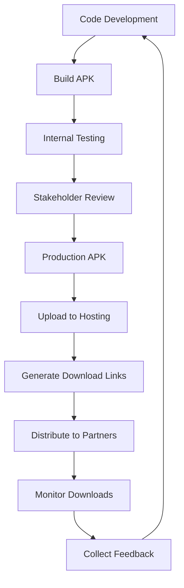

# 📱 TouristApp APK Deployment Guide

## Overview
This guide covers APK deployment options for the TouristApp Android application, providing alternatives to Google Play Store distribution.

## 🎯 APK Deployment Options

### 1. **Direct APK Distribution**
Perfect for:
- Internal testing
- Government/LGU distribution
- Tourism partner distribution
- Beta testing with specific users

### 2. **Sideloading for Tourism Partners**
Ideal for:
- Hotel chains
- Tourism offices
- Travel agencies
- Local businesses

### 3. **Internal Company Distribution**
Great for:
- Employee testing
- Stakeholder reviews
- Development team testing

## 🔧 APK Build Configuration

### Production APK Build
```bash
# Build production-ready APK
npm run build:apk

# Or directly with EAS
eas build --platform android --profile production-apk
```

### Preview APK Build (for testing)
```bash
# Build testing APK
npm run build:apk-preview

# Or directly with EAS
eas build --platform android --profile preview-apk
```

## 📁 APK Types Available

### 1. **Universal APK** (Recommended)
- Single APK works on all Android devices
- Larger file size (~50-100MB)
- Easier distribution
- Compatible with all architectures

### 2. **Split APKs** (Advanced)
- Separate APKs for different architectures
- Smaller individual file sizes
- More complex distribution
- Better for specific device targeting

## 🚀 Step-by-Step APK Deployment

### Step 1: Prepare for APK Build
```bash
# Ensure you're logged into EAS
eas login

# Verify your project configuration
eas build:configure
```

### Step 2: Build Production APK
```bash
# Build the APK
npm run build:apk

# Monitor build progress
# EAS will provide a download link when complete
```

### Step 3: Download and Test APK
1. Download APK from EAS build URL
2. Test on multiple Android devices
3. Verify all features work correctly
4. Check app performance and stability

### Step 4: Distribute APK

#### Option A: Direct Download
1. Upload APK to your web server
2. Create download page: `https://yoursite.com/download`
3. Share download link with users

#### Option B: Email Distribution
1. Email APK file directly (if under 25MB)
2. Use file sharing services for larger files
3. Include installation instructions

#### Option C: QR Code Distribution
1. Generate QR code pointing to download URL
2. Print QR codes for tourism materials
3. Display QR codes at tourism offices

## 📲 APK Installation Instructions

### For End Users:
```markdown
# Installing TouristApp APK

## Step 1: Enable Unknown Sources
1. Go to Settings → Security
2. Enable "Unknown Sources" or "Install from Unknown Sources"
3. Confirm the security warning

## Step 2: Download and Install
1. Download the TourMate.apk file
2. Open the downloaded file
3. Tap "Install" when prompted
4. Wait for installation to complete

## Step 3: Launch App
1. Find "TourMate" in your app drawer
2. Tap to open and start exploring Cebu!
```

## 🔐 Security Considerations

### APK Signing
- APKs are automatically signed by EAS
- Uses production signing keys
- Ensures app authenticity
- Prevents tampering

### Distribution Security
- Only distribute through trusted channels
- Verify APK integrity before distribution
- Monitor for unauthorized redistributions
- Keep track of APK versions distributed

## 📊 APK Distribution Tracking

### Analytics Setup
```javascript
// Track APK installations
import { Analytics } from 'expo';

// In your app startup
Analytics.track('apk_installation', {
  source: 'direct_download',
  version: '1.0.0',
  platform: 'android'
});
```

### Distribution Metrics
- Download count tracking
- Installation success rate
- Device compatibility reports
- User feedback collection

## 🏢 Government/LGU Distribution Strategy

### Tourism Office Distribution
1. **Setup**: Provide APKs to Cebu tourism offices
2. **Training**: Train staff on app features
3. **Materials**: Create promotional materials with QR codes
4. **Support**: Provide installation support

### Hotel/Resort Partnership
1. **Partnership Program**: Partner with hotels/resorts
2. **Guest Services**: Include in guest welcome packages
3. **WiFi Landing Pages**: Link APK download from WiFi portals
4. **Concierge Training**: Train staff to assist guests

### Travel Agency Integration
1. **Agent Training**: Train travel agents on app features
2. **Booking Integration**: Include app in travel packages
3. **Pre-trip Setup**: Install app during booking process
4. **Support Materials**: Provide troubleshooting guides

## 🔄 APK Update Strategy

### Over-the-Air Updates
```bash
# Deploy updates without new APK
eas update --branch production --message "Updated attractions and restaurants"
```

### Major Updates (New APK Required)
1. Build new APK version
2. Notify users via in-app notification
3. Provide download links for new version
4. Support both versions temporarily

## 💾 APK Storage and Hosting

### Recommended Hosting Options

#### 1. **Firebase Hosting** (Recommended)
```bash
# Setup Firebase hosting for APK downloads
npm install -g firebase-tools
firebase init hosting
firebase deploy
```

#### 2. **AWS S3 + CloudFront**
- Scalable file distribution
- Global CDN for fast downloads
- Cost-effective for large distributions

#### 3. **GitHub Releases**
- Free hosting for open-source projects
- Version control integration
- Automatic changelog generation

### APK Download Page Example
```html
<!DOCTYPE html>
<html>
<head>
    <title>Download TourMate - Cebu Tourism App</title>
    <meta name="viewport" content="width=device-width, initial-scale=1">
</head>
<body>
    <div class="container">
        <h1>🏝️ TourMate - Discover Cebu</h1>
        <p>Your ultimate guide to Cebu's attractions, restaurants, and beaches!</p>
        
        <div class="download-section">
            <h2>📱 Download for Android</h2>
            <a href="./TourMate-v1.0.0.apk" class="download-btn">
                Download APK (v1.0.0)
            </a>
            <p class="file-info">File size: ~85MB | Android 7.0+</p>
        </div>
        
        <div class="installation-guide">
            <h3>📋 Installation Steps</h3>
            <ol>
                <li>Enable "Install from Unknown Sources" in Settings</li>
                <li>Download and open the APK file</li>
                <li>Tap "Install" and wait for completion</li>
                <li>Open TourMate and start exploring!</li>
            </ol>
        </div>
    </div>
</body>
</html>
```

## 🚦 APK Distribution Workflow

### Development to Distribution


## 📞 Support for APK Users

### User Support Strategy
1. **Documentation**: Provide clear installation guides
2. **Video Tutorials**: Create installation walkthrough videos
3. **Support Channels**: WhatsApp/Email support for installation issues
4. **FAQ Section**: Common installation and usage questions

### Common APK Issues and Solutions

**Issue: "App not installed"**
- Solution: Enable Unknown Sources, check storage space

**Issue: "Parse error"**
- Solution: Download APK again, check device compatibility

**Issue: "App keeps crashing"**
- Solution: Clear app data, restart device, reinstall

## 📈 Success Metrics for APK Distribution

### Key Performance Indicators
- **Download Rate**: APK downloads per day/week
- **Installation Success**: % of downloads that result in installations  
- **User Retention**: % of APK users who continue using the app
- **Feature Usage**: Most used features by APK users
- **Feedback Score**: User satisfaction ratings

### Tracking Tools
- Google Analytics for download tracking
- Firebase Analytics for app usage
- Custom analytics for distribution channels
- User feedback forms and surveys

## 🔧 Technical Requirements

### Minimum Android Requirements
- **Android Version**: 7.0 (API level 24) or higher
- **RAM**: 3GB minimum, 4GB recommended
- **Storage**: 200MB free space for installation
- **Internet**: Required for app functionality

### Device Compatibility
- **Phones**: All Android phones meeting minimum requirements
- **Tablets**: Android tablets 7+ inches supported
- **Architecture**: ARM64, ARM, x86 supported
- **Google Services**: Firebase requires Google Play Services

---

## Quick APK Commands

```bash
# Build production APK
npm run build:apk

# Build testing APK  
npm run build:apk-preview

# Update existing APK installations
eas update --branch production

# Check build status
eas build:list
```

APK deployment gives you complete control over distribution and is perfect for the tourism industry where you might want to distribute directly to hotels, tourism offices, and partners without going through the Play Store! 